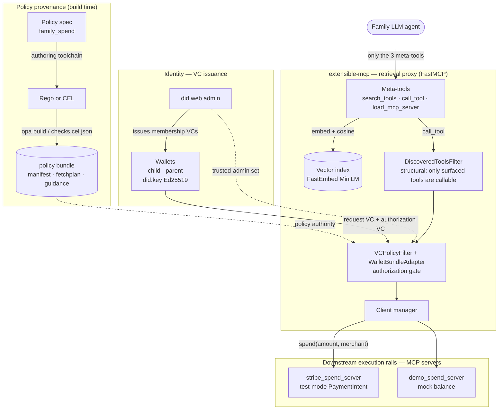
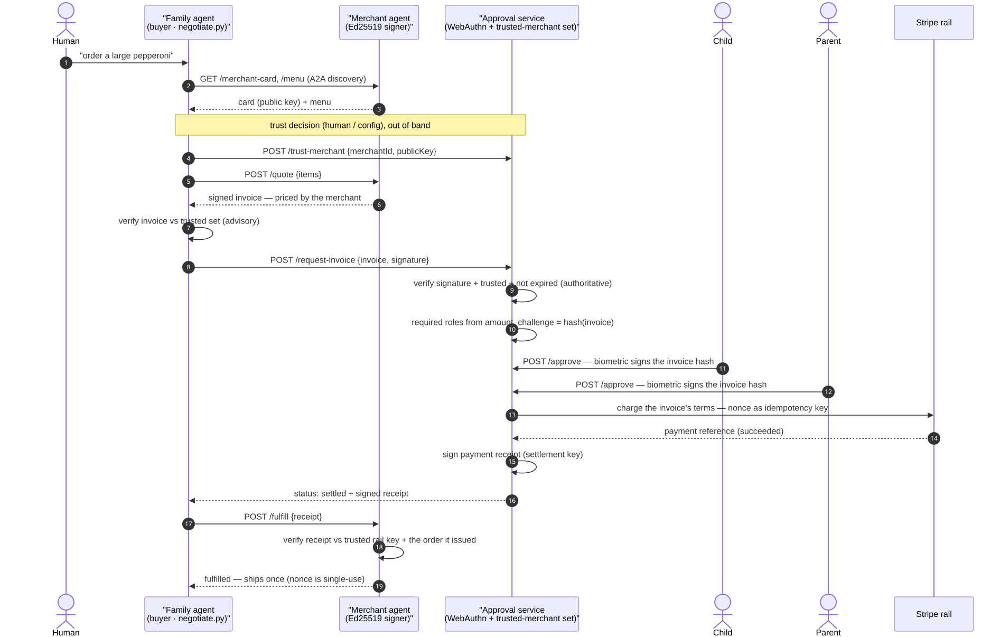
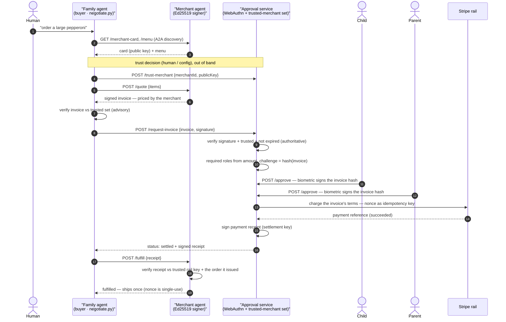
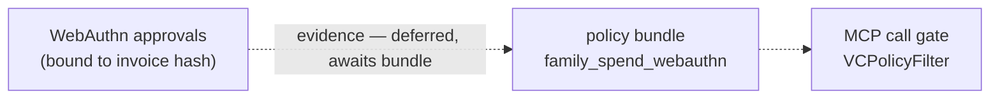

# Architecture

Two enforcement paths sit on the same model — *N cheap authenticated approvals →
a typed policy → one heavy execution act* — wired at different points:

1. **MCP call gate** — the LLM reaches tools only through the retrieval proxy,
   and a `spend` call is authorized by a supplied policy bundle against wallet
   VCs before it ever reaches the payment rail.
2. **Commerce / human-approval path** (stages 1–3) — a merchant-signed invoice
   is negotiated over A2A, verified against a trusted-merchant set, bound to
   child + parent WebAuthn approvals, settled on the rail for exactly its terms,
   and fulfilled by the merchant against a signed payment receipt.

Legend for both diagrams: **solid** = implemented runtime flow · **dashed** =
trust anchor / build-time provenance · **dotted** = designed but not yet wired.

## System components (MCP enforcement path)

Diagram source (Mermaid)

The LLM never sees the whole tool catalogue or the payment credential: it gets
three meta-tools, discovers tools by vector search, and every `call_tool` passes
`DiscoveredToolsFilter` (can't call what it never surfaced) then `VCPolicyFilter`
(the policy bundle, evaluated over the child's request VC and the parent's
authorization VC, anchored to the trusted-admin set). Only then does the client
manager proxy `spend` to the rail.

## Commerce path — stages 1–3 (negotiate → approve → pay → fulfill)

Diagram source (Mermaid)

The A2A channel is **untrusted**: a manipulated buyer agent can garble or drop
the negotiation, but it cannot forge terms — the merchant's signature over a
concrete invoice is the only thing that carries weight, and the approval service
re-verifies it authoritatively against the trusted-merchant set before any human
is asked. Each biometric binds to `hash(invoice)`, so an approval for one invoice
can never authorize another.

The same discipline carries through settlement and fulfilment: the rail is
charged for exactly the invoice's terms with the invoice `nonce` as the
idempotency key (no double-charge on retry), and the merchant ships only against
a receipt signed by the rail it trusts, matched to the order it issued, exactly
once. No hop — buyer agent included — is believed on its word; every one carries
verifiable signed evidence.

## How the two paths relate

Both realize the same decomposition — several cheap, non-repudiable approvals
gate one expensive execution act — but at different seams, and they are not yet
unified:

- The **VC path** proves *who authorized* via wallet-issued VCs checked by the
  supplied policy bundle inside the MCP call gate.
- The **WebAuthn path** proves *a human physically approved this exact object*
  and binds the merchant's committed terms.

Diagram source (Mermaid)

Convergence — having the `family_spend_webauthn` policy bundle consume
WebAuthn evidence so a single policy governs both the VC chain and the human
biometric at the MCP call gate — is designed but deferred.
It is now the only deferred seam: the commerce path runs end to end through
settlement and fulfilment (stage 3).
